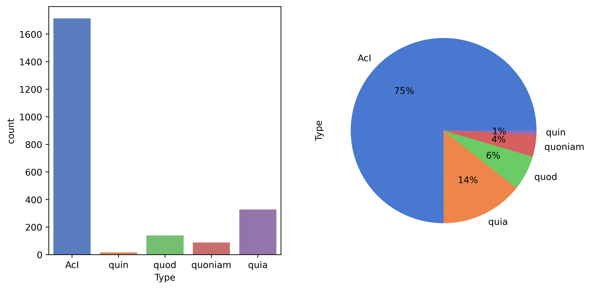

# Final Report
Ben Miller (bam197@pitt.edu)
May 1, 2022

## Introduction
In this final report, I will go over the history of the project and give the final analysis of the data.

I chose this project topic as I have an interest in historical linguistics and languages.
I felt the corpus I found, the PROIEL Treebank, would be suitable for examining potential change throughout Latin's history,
as it contains both early (1st century BCE) and later (4th-5th century CE) texts.

I settled on looking at indirect speech as I remembered having encountered a complementizer while trying to read a later Latin text,
and being puzzled by it, since I was more familiar with the accusative + infinitive construction.
The complementizer construction more resembled the syntax of modern Romance languages.
The complementizers in question were Latin subordinating conjunctions, typically with a causal meaning, e.g. 'because' or 'since'.
I decided to see if there was a trend toward complementizer use in later texts that reflected this shift, as well as
examining frequencies of certain morphological forms in different kinds of indirect speech constructions.

During the project, I received feedback from classmates in the form of guestbook entries.
One file I added due to this feedback was the [introduction to indirect speech](oo_introduction.md), which explains the constructions
I looked for in the project.

## Obtaining and processing the data
To process the data, I wrote an [annotator script](annotations/annotate.py).
My initial plan was to manually annotate, but this quickly proved infeasible.
There were simply too many possible sentences, and my Latin was not good enough to make a classification in which I had confidence.
Luckily, I found that the PROIEL Treebank encoded the necessary syntactic information to extract the sentences I needed.
I simply had to find infinitives and conjunctions with the syntactic role 'complementizer'.
I also collected information on the main verb, as well as morphological information on the verb in the subclause.
I then added it as XML attributes on the sentence tag, and saved it.
It was then a simple task of parsing out the relevant information from my new XML files and placing it in a pandas dataframe, seen [here](https://nbviewer.org/github/Data-Science-for-Linguists-2022/Latin-Indirect-Speech/blob/main/notebooks/Analysis.ipynb#Imports).

## Analysis

### Type

I first looked at what types we found in the data ([Notebook](https://nbviewer.org/github/Data-Science-for-Linguists-2022/Latin-Indirect-Speech/blob/main/notebooks/Analysis.ipynb#Plots)):

As can be seen above, the accusative + infinitive construction was the most common, with *quīn* being the least common.

### Type by era

Honing in on the difference by era, the complementizer constructions show an increase in Late texts.
This graph also reveals that *quīn* is restricted to the Classical text.

### Type by author

[!png](presentation/graphs/type_by_auth.png)

Jerome has the most complementizers; much more than his fellow Late authors.
I did some research into this, and found that Jerome was known for preserving the syntax and constructions of the languages from which he translated;
furthermore, Koine Greek, the original language of the New Testament, has complementizers.
It is therefore possible that his data may not indicate a wholly-Latin development, but is rather the result of Jerome's translation methods.

I then decided to look into how morphological categories like tense, voice, and mood differed between different constructions.

### Voice by type

([Notebook](https://nbviewer.org/github/Data-Science-for-Linguists-2022/Latin-Indirect-Speech/blob/main/notebooks/Analysis.ipynb#Further-Analysis-(Progress-Report-3)))

[!png](presentation/graphs/voice_by_type.png)

The active voice is always more common than the passive, an unsurprising result.

### Tense by type

Looking at tense, the present is always the most common.
It is important to note that for the accusative + infinitive construction, 'tense' refers to the distinction between
perfect, present, and future infinitives, which are *relative* tenses, i.e. they refer not to absolute time points,
but to points relative to the main verb.
In addition, the present is often used for past events in Latin, a style called the *historical present*.

*Quīn* shows an even spread of tenses.
The other complementizers, however, have differences between them.
Both *quoniam* and *quia* have more instances of a future verb than an imperfect.
Across all non-*quīn* conjunctions, the perfect occurs more frequently than the imperfect.

### Mood by type and author

Next, I looked at mood.
Accusative + infinitive constructions were ignored, as infinitives do not carry modal information in Latin.

[!png](presentation/graphs/mood_by_type_auth.png)

The indicative is the most common mood.
This surprised me, as I had read that the subjunctive was usually employed in complementizer clauses.
There does seem to be some sort of subjunctive force to complementization, however, as it is used where it would not be expected.
For example, *quoniam* typically is followed by a verb in the indicative, but the data has multiple instances where it is followed by the subjunctive.

### Tense and voice -- examining a develoment in modern Romance

In modern Romance languages, the Latin passive and future were completely replaced.
In the case of the passive, it was replaced by a form of the verb *sum* 'to be' and a passive participle.
The future developed differently in certain branches, but most show a new synthetic construction formed from the fusion
of the infinitive with the present indicative forms of the verb *habeō* 'to have'.

I decided to examine the Late texts in relation to the Classical for evidence of these changes.

[!png](presentation/graphs/tense_voice_by_era.png)

I found, however, that was no evidence of a change.
In fact, the future was more common in Late texts!
It is possible that even these 'Late' texts predate these changes.
Or, it could be an instance of written texts showing more conservative or archaicizing language than normal speech would.

## Conclusions

Overall, it seems that while Late texts show an increase in the amount of complementizer constructions, it is *not* the case
that the accusative + infinitive construction began to disappear.
If we count Jerome's usage (which, as mentioned, is somewhat problematic), it still accounts for about half of all
indirect speech constructions.
If we ignore Jerome, the accusative + infinitive is the most common construction across all eras.

Additionally, my hypothesis that the subjunctive would be more common in complementizer clauses was proven false.
Instead, it was the indicative that was most common.
This aligns with modern Romance languages' indirect speech constructions, which typically employ the indicative,
and occasionally the subjunctive (typically after verbs of feeling, doubt, obligation, etc.).

One potential avenue of further research could be to look at Medieval Latin as well.
Since many Medieval Latin authors were speakers of (usually seldom-written) Romance languages,
their Latin may show influence from their native language, allowing this shift to be traced beyond the 5th century.
However, there would be the challenge of finding an annotated Medieval corpus, as I would be unable to do the annotation myself.
